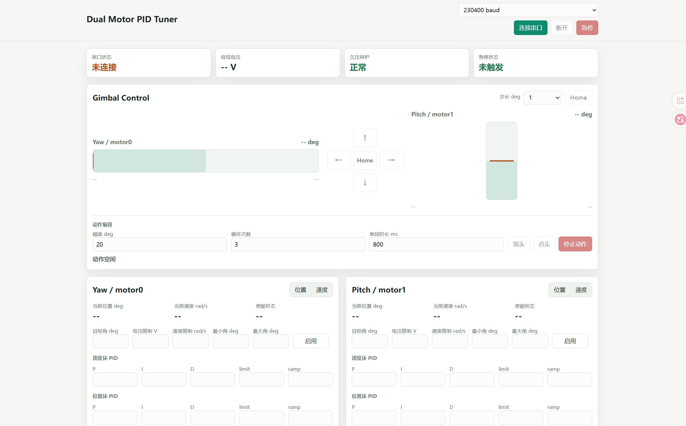
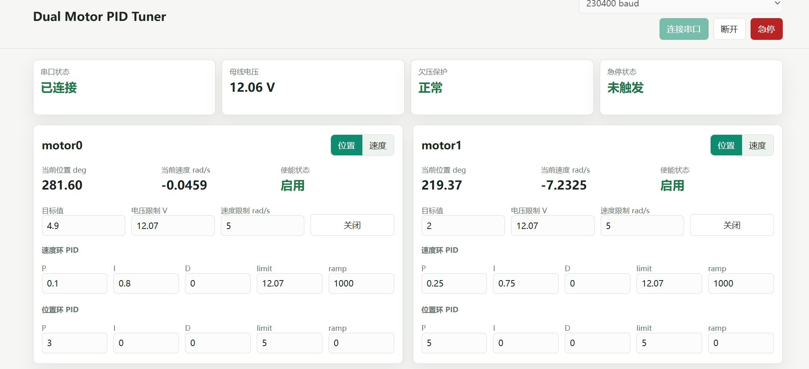
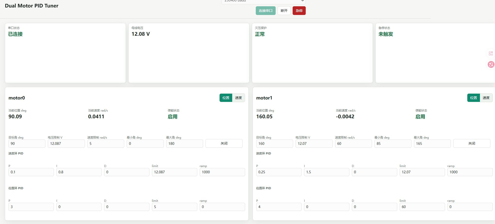

# 2DOFs Gimbal

基于 ESP32、SimpleFOC、双无刷电机和双 AS5600 磁编码器实现的两自由度云台。项目包含 Yaw / Pitch 双轴闭环控制固件、浏览器 PID 调参面板、结构模型以及硬件参考资料，可用于云台结构验证、FOC 调试和串口控制实验。

> 当前版本仍处于硬件调试阶段。上电前请先确认机械限位、供电电压、电机极对数与引脚配置，并确保急停或断电手段随时可用。



## 功能特性

- 双轴 FOC：`motor0` 控制 Yaw，`motor1` 控制 Pitch
- 支持位置模式与速度模式，并可分别启用或关闭两个电机
- 在浏览器中通过 Web Serial 实时读取角度、速度、母线电压和运行状态
- 在线修改速度环 / 位置环 PID、输出限制、速度限制和角度范围
- 提供云台方向控制、步进点动、Home 和急停操作
- 具备 11.1 V 欠压保护、目标角限幅和串口急停
- 附带 SolidWorks / STEP 结构模型、电机尺寸图、驱动板及编码器资料

## 系统组成

| 模块 | 当前配置 |
| --- | --- |
| 主控 | LOLIN32 Lite（ESP32） |
| 控制框架 | Arduino + SimpleFOC 2.2.1 |
| 驱动方式 | 双路 3PWM 无刷电机驱动 |
| 位置反馈 | 2 × AS5600，通过两路独立 I²C 总线读取 |
| 控制轴 | Yaw（motor0）/ Pitch（motor1） |
| Yaw 电机 | GB1806 云台无刷电机 |
| Pitch 电机 | GB1105 云台无刷电机 |
| 调参方式 | Web Serial，230400 baud |
| 开发环境 | PlatformIO |

### 电机型号与购买链接

| 控制轴 | 电机型号 | 购买链接 |
| --- | --- | --- |
| Yaw / motor0 | **GB1806 云台无刷电机** | [淘宝购买](https://item.taobao.com/item.htm?id=809646293074) |
| Pitch / motor1 | **GB1105 云台无刷电机** | [淘宝购买](https://item.taobao.com/item.htm?id=650837545641) |

> 商品页面的价格、库存和可选配置可能发生变化，下单前请再次确认电机型号、绕组、编码器选项及安装尺寸。

### 当前固件引脚

| 功能 | motor0 / Yaw | motor1 / Pitch |
| --- | ---: | ---: |
| 电机极对数 | 7 | 6 |
| 3PWM | GPIO 32 / 33 / 25 | GPIO 26 / 27 / 14 |
| 驱动使能 | GPIO 12（两轴共用） | GPIO 12（两轴共用） |
| AS5600 SDA / SCL | GPIO 19 / 18 | GPIO 23 / 5 |

母线电压由 GPIO 13 采样，源码使用 `8.5` 倍分压换算，并在电压低于 `11.1 V` 时关闭电机。若硬件版本或分压电阻不同，请先修改 [`src/main.cpp`](./src/main.cpp) 中的配置。

## 快速开始

### 1. 准备环境

- 安装 [Visual Studio Code](https://code.visualstudio.com/) 与 [PlatformIO IDE](https://platformio.org/install/ide?install=vscode)，或单独安装 PlatformIO Core
- 使用支持 Web Serial 的桌面版 Chrome 或 Edge
- 接线并检查两个电机、两个 AS5600、驱动板、公共地和电源

### 2. 获取并编译固件

```bash
git clone https://github.com/WilliamLiao266/2DOFs-Gimbal.git
cd 2DOFs-Gimbal
pio run
```

### 3. 烧录与查看串口

连接 ESP32 后执行：

```bash
pio run --target upload
pio device monitor --baud 230400
```

如果自动识别不到串口，可在 `platformio.ini` 中设置 `upload_port` 和 `monitor_port`，或在命令中通过 `--upload-port` / `--port` 指定。

### 4. 打开 Web 调参面板

先退出串口监视器，避免串口被占用。然后在仓库根目录启动本地静态服务器：

```bash
python -m http.server 8000 --directory tools
```

使用 Chrome 或 Edge 打开 <http://localhost:8000/pid_tuner.html>，保持波特率为 `230400`，点击“连接串口”并选择 ESP32 对应端口。

> 浏览器串口和 PlatformIO 串口监视器不能同时占用同一个端口。调参时建议先设置较小的电压 / 速度限制，并逐轴启用。

## 默认控制参数

| 参数 | Yaw / motor0 | Pitch / motor1 |
| --- | ---: | ---: |
| 初始目标角 | 90° | 135° |
| 角度范围 | 0° ～ 180° | 85° ～ 165° |
| 电压限制 | 12.087 V | 12.070 V |
| 速度限制 | 5 rad/s | 60 rad/s |
| 速度环 P / I / D | 0.10 / 0.80 / 0 | 0.25 / 1.50 / 0 |
| 位置环 P / I / D | 3.0 / 0 / 0 | 4.0 / 0 / 0 |

以上是当前样机参数，不应直接视为其他电机或机械结构的安全参数。更换电机、供电、负载或减速结构后，请重新辨识方向、极对数、零位和 PID。

## 串口协议

命令使用英文逗号分隔，并以换行符结束。电机索引 `0` 为 Yaw，`1` 为 Pitch。

| 操作 | 示例 |
| --- | --- |
| 切换模式 | `MODE,0,angle` / `MODE,1,velocity` |
| 设置目标 | `TARGET,0,90` |
| 修改 PID | `PID,0,vel,P,0.1` |
| 修改电压限制 | `LIMIT,0,voltage,6` |
| 修改速度限制 | `LIMIT,1,velocity,10` |
| 修改角度范围 | `LIMIT,1,angleMin,85` |
| 启用 / 关闭电机 | `ENABLE,0,1` / `ENABLE,0,0` |
| 两轴急停 | `ESTOP` |

固件以 JSON Lines 形式返回遥测、确认和错误消息，Web 调参面板会自动解析这些数据。

## 调参记录

下图记录了两轮 PID 调试结果。第二轮加入了更明确的角度范围和两轴差异化参数，当前源码中的默认值以最新一轮结果为基础。

| 2026-05-21 初步调参 | 2026-05-22 迭代调参 |
| --- | --- |
|  |  |

## 项目结构

```text
.
├── src/main.cpp             # ESP32 双轴 FOC 固件与串口协议
├── tools/pid_tuner.html     # Web Serial 调参与云台控制面板
├── Motor_config/            # 电机资料图片
├── hardware_resource/       # 驱动板、编码器和安装尺寸资料
├── model/                   # SolidWorks 装配体、零件与 STEP 模型
├── platformio.ini           # PlatformIO 工程配置
├── 网页截图.jpg
├── 5.21PID参数.jpg
└── 5.22PID参数.jpg
```

## 安全提示

- 首次启动时拆除易碰撞负载，固定云台底座，并预留断电空间。
- `initFOC()` 会执行传感器与电机对齐；校准期间电机可能转动。
- GPIO 12 为两路驱动共用使能，请确认硬件连接与启动电平符合当前驱动板。
- 电压限制是控制器输出限制，不等同于电源或电机的额定安全电压。
- 调整角度上下限前先确认编码器方向和机械零位，防止撞击结构限位。
- 急停后需发送新的 `ENABLE` 命令才能恢复对应电机，请先排除故障原因。

## 许可证

本仓库目前尚未添加开源许可证。在许可证明确前，默认保留全部权利；如计划开放复用或接受外部贡献，请在发布时补充合适的 `LICENSE` 文件。
